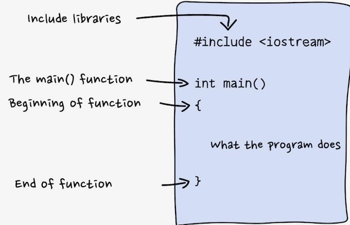
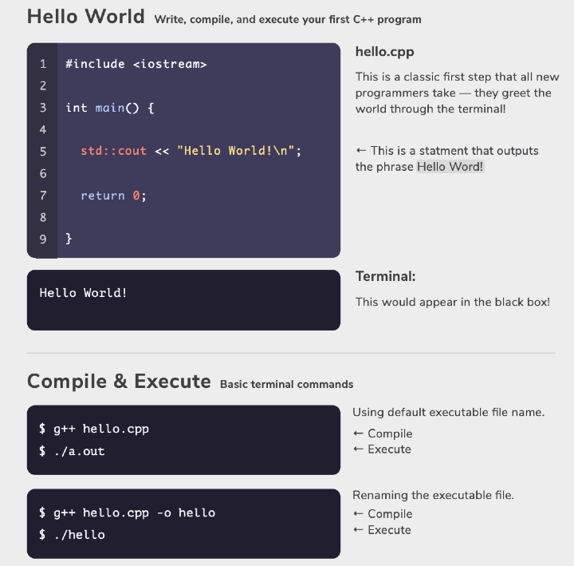

# **Basic C ++ Concepts**


## Compiling with C
https://courses.cs.washington.edu/courses/cse373/99au/unix/g++.html

## Variables

Type: Usage (Examples)<br>
int: integer numbers (0 , 420)<br>
double: floating-point numberw (3.14, -200.0)<br>
char: characters ('a, '@')<br>
string: sequence of characters ("Hello Worlds!, "Hi")<br>
bool: truth values (true false)<br>

## Arithmetic Operators 

&rarr; + addition<br>
&rarr; - subtraction<br>
&rarr; * multiplication<br>
&rarr; +/ division<br>
&rarr; % modulo which gives remainder<br>
&rarr; pow () is exponents (7.0, 3.0) = 343<br>

### input and output
We have cout for output, and there is something called cin is used for input!
```cpp
string password;

std::cout << "Enter your password: ";
std::cin >> password;
std:: cout << "Your password is " << password "\n";
```